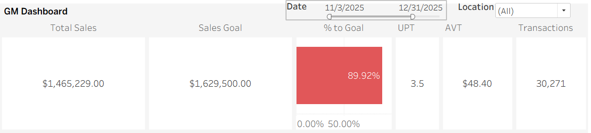

# Retail Performance Analysis (MMTC)

## Project Overview

This project analyzes retail sales performance across a multi-location
medical cannabis retail operation using Tableau. 
The dashboard provides a high-level view of sales results, goal attainment, transaction behavior, 
and product performance to support store-level and regional decision-making.

## Tools Used
- Tableau Public
- Excel (raw sales data)
- GitHub

## Key Business Questions

- Are stores meeting their sales goals for the selected period?
- How close is each store to its sales target (% to goal)?
- Which product categories drive the most revenue and unit volume?
- Which products are underperforming and may require review?
- How do transactions, units per transaction (UPT), and average ticket value (AVT) contribute to sales?
- What trends exist in new patient activity over time?

## Dashboard Features

- KPI summary including Total Sales, Sales Goal, % to Goal, UPT, AVT, and Transactions
- Sales and unit volume by product category
- Bottom-performing products by revenue
- New patient trend over time
- Interactive filters for date range and store location

### GM KPI Overview

### GM Sales Performance Dashboard

## Data Structure

- `data/raw/` – Original Excel sales data
- `data/results/` – Cleaned and aggregated datasets used in Tableau
- `tableau/` – Tableau workbook (.twb) file
- `images/` – Exported dashboard images for documentation

## Key Insights

- Sales performance varies by location, with some stores consistently closer to goal than others.
- Certain product categories drive higher revenue while others contribute more to transaction volume.
- A small set of products underperform relative to overall sales and may require merchandising review.
- New patient activity shows noticeable fluctuations over the selected period.

## Next Steps

- Add week-over-week trend analysis
- Incorporate labor or cost data for profitability insights
- Expand dashboard to include regional performance comparisons
